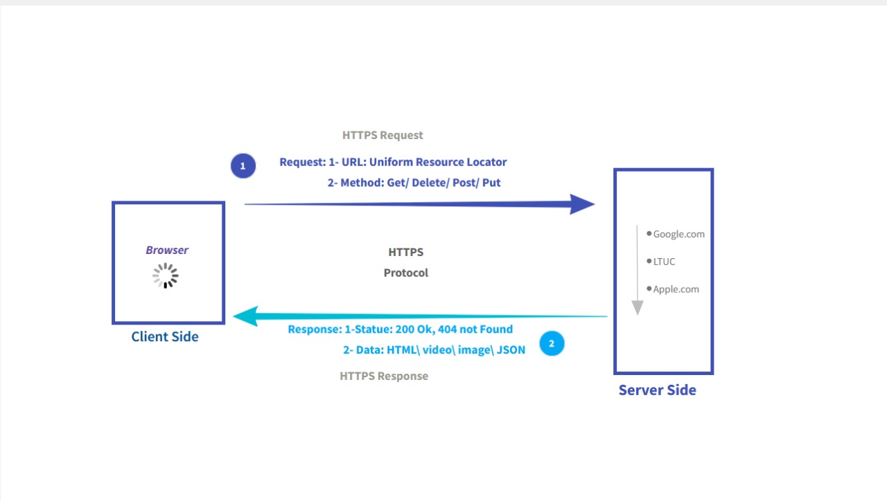

> # Movies_Library - V.0.0 🎬❤️

**Author Name**: Raneem Hamid 

## WRRC

## Overview
#### This application serves as a basic framework for serving movie data and handling simple HTTP requests.
## Getting Started
- Node JS (Runtime enviroment) 
- Building a server : 
    - Use Express (Frame Work for node js ) By :
        - `npm init -y`: Use this command to create a package.json .
        - `npm install express` : To install the express package.
        - `npm file name ` : To run the server.

## Project Features
1.  Routing 
    - Home Routing. 
    - Favorite Routing .
2. Error Handling: The app handel two type of error 
    - 500: "Internal Server Error".
    - 404: "Not Found".
3. Server SetUp.
4. Data Handling.
